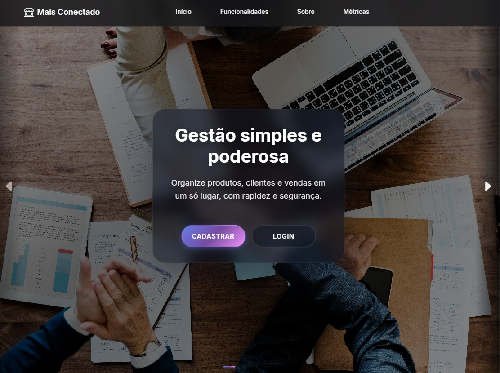

<div align="center">
	
	<h1>Mais Conectado</h1>
	<p><strong>Conexão simples para pequenos negócios</strong></p>
	<p>Gestão de produtos, clientes, vendas e crédito fiado de forma moderna, rápida e acessível.</p>
	<p><a href="https://maisconectado.alwaysdata.net" target="_blank">Acessar DEMO online</a></p>
</div>

## 💡 Ideia do Projeto
O Mais Conectado nasceu para eliminar processos manuais e desorganizados em pequenos comércios. A proposta é oferecer uma experiência unificada onde o dono do negócio acompanha vendas, estoque, relacionamento com clientes e concessão de crédito (fiado) com transparência e velocidade, sem precisar de conhecimento técnico avançado. O foco central é simplicidade, confiança e acesso rápido às informações essenciais do dia a dia.

---

## ✨ Visão Geral
Mais Conectado é uma plataforma web construída com Laravel (PHP) e frontend progressivo que oferece:
- Controle de produtos, estoque e movimentações
- Cadastro e gestão de clientes
- Sistema de vendas com itens e totalização
- Módulo de crédito fiado transparente (limites, histórico, parcelas)
- Autenticação com fluxo de sessão + token "lembre-me" otimizado
- SEO preparado (sitemap.xml, robots.txt, meta tags, JSON-LD Organization)

## 🚀 Tecnologias Principais
| Camada | Stack |
|--------|-------|
| Backend | Laravel 12, PHP 8+ |
| Frontend | Blade + Vite (modular CSS/JS) |
| Build | Vite + ESBuild |
| Testes | Pest / PHPUnit |
| Cache / Sessões | Laravel Cache / Session |
| SEO | Sitemap, Robots, Structured Data |

## 🧱 Arquitetura em Alto Nível
Estruturada em camadas claras para facilitar manutenção e evolução:
- Entrada (HTTP): controllers simples + middlewares que aplicam autenticação, limites e cabeçalhos.
- Serviços: encapsulam regras de negócio (ex.: autenticação e emissão controlada de tokens) sem expor detalhes internos.
- Persistência: modelos representam entidades centrais (usuários, vendas, itens, categorias, crédito). Nomes e estrutura são deliberadamente abstraídos aqui para evitar exposição de detalhes sensíveis.
- Interface: templates Blade/CSS modular com Vite para build rápido.
- Infra: provedores registram singletons e configurações.

## 🔐 Segurança — Visão Geral
- Cabeçalhos reforçados (anti XSS, clickjacking, sniffing) e política de referência restritiva.
- Política de segurança de conteúdo (CSP) pronta para produção (descomentável) reduz superfícies de ataque.
- Limites de tentativas para login e cadastro mitigam força bruta.
- Autenticação híbrida: sessão tem precedência; token persistente só reativa acesso se válido.
- Cookies com bandeiras seguras (HttpOnly / SameSite) para redução de riscos de CSRF.
- Nunca expõe diretamente nomes de tabelas ou estruturas sensíveis no material público.

## 🔄 Sessão, Cache e "Lembre-se de mim"
Fluxo desenhado para estabilidade e mínima fricção:
- Recuperação prioritária via sessão ativa; evita recomputações desnecessárias.
- Token persistente atua como camada secundária (lembrar acesso) sem sobrescrever sessão válida.
- Renovação e revogação controladas para garantir apenas um token efetivo por usuário.
- Cache reduz leitura de banco e acelera validações sem expor segredos.

## 🛡️ Proteção contra Ataques
- Mitigação de força bruta (limites temporários por IP em pontos sensíveis).
- Minimização de riscos de fixation mantendo fluxo previsível de sessão.
- Cabeçalhos defensivos e CSP (ativável) para reduzir XSS / Injection de conteúdo.
- Proteções padrão do framework para CSRF somadas a SameSite.

## ♿ Acessibilidade (A11y)
- Uso de `aria-label` em elementos de navegação e botões
- Foco visível em componentes interativos
- `prefers-reduced-motion` respeitado no CSS para reduzir animações
- Contraste ajustado em seções claras (cards e métricas) para legibilidade

## 📱 Design responsivo
- Grid responsivo com `auto-fit/minmax`, flex e clamp para tipografia espaçamentos
- Breakpoints definidos (992px, 768px, 480px) com layouts específicos para mobile/tablet/desktop
- Imagens com `object-fit` e `loading` apropriado; carrossel com `fetchpriority="high"` no primeiro banner

## 📷 Imagem de Capa
Substitua `docs/assets/cover.png` por um screenshot real da tela inicial (1920x1080 recomendado). Para aparecer como preview social no GitHub, crie também `docs/assets/social-preview.png` (1280x640) e configure em Settings > Social preview.

## 🗂️ Estrutura Simplificada
```
public/            # Arquivos públicos (index.php, sitemap, favicon, logo)
resources/views/   # Blade templates (home, login, cadastro, componentes)
resources/css/     # Estilos segmentados (home, navbar, etc.)
app/Models/        # Modelos: Produto, Categoria, Cliente, Venda...
app/Http/Middleware/RequireTokenOrSession.php  # Middleware otimizado de sessão/token
database/migrations/  # Estrutura das tabelas
tests/            # Testes Pest / PHPUnit
```

## 🔐 Fluxo de Autenticação "Lembre-me"
1. Sessão ativa sempre tem prioridade
2. Token persistente só recria sessão se válido e usuário não estiver autenticado
3. Invalidar token não força logout imediato se sessão estável existir
4. Middleware unifica lógica (verificação cache + DB)

## 🧪 Testes Rápidos
Execute a suíte básica:
```bash
php artisan test
```
Ou com Pest:
```bash
./vendor/bin/pest
```

## ⚙️ Instalação
```bash
git clone <repo>
cd TCC
composer install
cp .env.example .env
php artisan key:generate
php artisan migrate --seed
npm install
npm run build   # ou npm run dev para ambiente de desenvolvimento
php artisan serve
```

## 🌐 SEO & Indexação
- `public/sitemap.xml` gera estrutura para indexação
- `public/robots.txt` permite crawl geral
- JSON-LD em `public/organization.json` descreve a marca
- Meta tags otimizadas na `home.blade.php`
 - Social preview configurável (Settings > Social preview) usando `docs/assets/social-preview.png` (1280x640)

## ⚙️ Ativação da CSP em Produção
No middleware de cabeçalhos, descomente a linha da Content-Security-Policy e ajuste domínios confiáveis (origem própria + CDNs usados).

## © Direitos Autorais & Uso
© 2025 Pablo Braz & Gabriel Faria. Todos os direitos reservados.

Este repositório é disponibilizado para fins educacionais e avaliação técnica. Qualquer reutilização comercial, distribuição ou derivação significativa dos arquivos exige autorização explícita dos autores.

Contato para permissões e dúvidas:
- Pablo Braz: pbraz0460@gmail.com
- Gabriel Faria: gabrielfariadossantos1382007@gmail.com

Ao clonar ou reutilizar partes do código, mantenha este aviso e referências de autoria.

## 🛠 Próximas Melhorias Sugeridas
- Painel analítico (gráficos de vendas e estoque)
- API REST para integrações externas
- Filas (queue) para notificações e e-mails
- Internacionalização completa (multi-idioma)

## 🤝 Contribuição
Pull requests são bem-vindos. Abra uma issue com contexto claro. Mantenha padrão PSR-12 e escreva pelo menos um teste para novas regras de negócio.

## 📄 Licença
MIT. Sinta-se livre para usar e adaptar com atribuição.

## 🧾 Créditos
Baseado em arquitetura Laravel moderna + ajustes personalizados para fluxo de sessão/token e SEO.

---
Se este projeto ajudou você, considere dar uma ⭐ no repositório!
